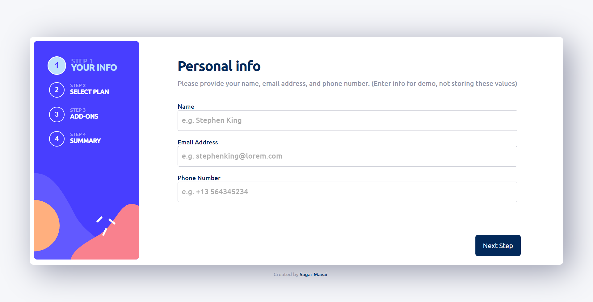

# Multi-step Form

A multi-step form with Razorpay payment and automatic currency conversion in latest conversion rates based on the user's IP address. You can add this component directly in your Website with some minimal backend integration.

<b>\*\*\*Payment is being done in test mode. You can complete the payments without worrying about deduction of money from your account.</b>

Live view 👉 [click here](https://sagar969.github.io/multi-step-form/)

## Table of contents

- [Overview](#overview)
  - [Working](#working)
  - [Links](#the-links)
  - [Screenshots](#screenshots)
    - [Desktop veiw](#desktop-view)
    - [Mobile veiw](#mobile-view)
- [My process](#my-process)
  - [Built with](#built-with)
  - [What I learned](#what-i-learned)
- [Author](#author)

## Overview

This is a multi-step form with both desktop and mobile view. It has four steps and a Thank you note at the end.

#### Step 1 (Your Info)

Users enter their name, email address and phone number in this step. If there is an invalid input, user can see an error message popping up.

#### Step 2 (Select Plan)

Users choose their subscription plan in this step and can also switch between monthly and yearly plans.

#### Step 3 (Add-ons)

users choose any add-on they want with their plan in this step. Pricing changes based on the type of plan (monthly or yearly) chosen in step 2.

#### Step 4 (Summary)

Users can see the summary of their inputs that consist chosen plan and add-ons. User can see a pay button here that they can click to pay the subscription fee.

#### Payment

Users can see a modal of Razorpay payment where they need to choose payment method and enter their account details.

#### Thanking

After completing the payment, users will see a thank you message. You can redirect user anywhere from here.

### Working

- On loading the web app, [IPdata Api](https://ipdata.co/) is used to fetch the currency symbol and currency code based on the user's IP address.
- After getting the data about currency from user's IP address, [exchange-rate API](https://www.exchangerate-api.com/) is used to fetch latest currency conversion rates for currencies all around the world and modify all the data based currency code and conversion rates.
- User go through step 1 to 4 filling the required details and choosing a plan and add-ons.
- User can pay the subcribtion fee through the integrated Razorpay payment gateway.
- User gets redirected to Thank You message.

### The Links

- Source Code URL : [click here](https://github.com/Sagar969/multi-step-form)
- Live Site URL : [click here](https://sagar969.github.io/multi-step-form/)

### Screenshots

This app is responsive to every screen size out there in market.
Desktop and Mobile view -

#### Desktop View

#### Mobile View

## My Process

This app is built in mobile-first workflow and then made responsive for bigger screens

### Built with

- [ReactJS](https://react.dev/) - JS library
- [CSS](https://www.w3schools.com/css/css_intro.asp) - for styling
- [Styled components](https://styled-components.com/) - for animations
- [IPdata API](https://ipdata.co/) - for data about currency being used based on user's IP address
- [Exchange rate API](https://www.exchangerate-api.com/) - for latest currency exchange rates

### What I learned

In this project, I learned some new concepts and made a strong grip in some others. In the process of code, I :

- Learned the Regular Expressions and used them to validate input values.
- Heavily used and learned React Context API.
- Learned styled components by animating the components.
- Got to learn more about React hooks like useCallback and others.

## Author

- Github - [Sagar969](https://github.com/Sagar969)
- LinkedIn - [Sagar Mavai](https://www.linkedin.com/in/sagar-mavai-986b25206)
- Twitter - [@SagarMavai](https://twitter.com/SagarMavai)
